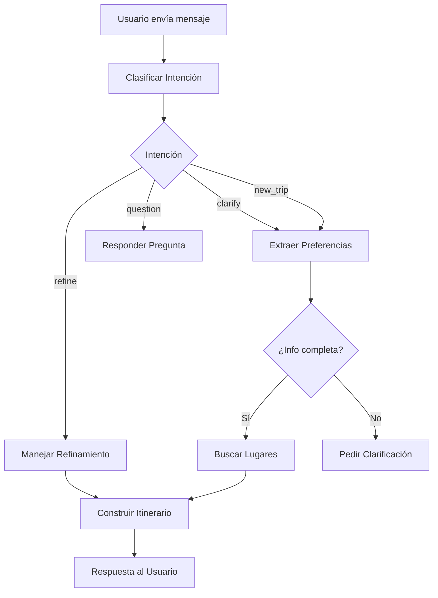

# Agentes IA - Vora Travel

## Arquitectura

El sistema de agentes está construido con **LangGraph** y utiliza **GPT-4** para procesamiento de lenguaje natural.

### Componentes Principales

```
app/agents/
├── state.py              # Estado compartido del agente
├── graph.py              # Grafo principal de LangGraph
├── nodes/                # Nodos del grafo
│   ├── intent_classifier.py      # Clasifica intención del usuario
│   ├── preference_extractor.py   # Extrae preferencias de viaje
│   ├── place_searcher.py         # Busca lugares con Google Places
│   ├── itinerary_builder.py      # Construye itinerarios completos
│   └── refinement_handler.py     # Maneja refinamientos
└── tools/
    └── google_places.py  # Cliente de Google Places API
```

## Flujo del Agente



## Estado del Agente

El estado (`TravelState`) mantiene:

- **Conversación**: Historial de mensajes
- **Intención**: new_trip, refine, question, clarify
- **Preferencias**: destino, días, presupuesto, estilo de viaje, viajeros
- **Lugares**: Resultados de búsqueda de Google Places
- **Itinerario**: Plan día a día generado
- **Control**: Flags de clarificación, contador de iteraciones

## Uso

### Endpoint de Chat

```bash
POST /api/v1/chat
Content-Type: application/json
Authorization: Bearer <token>

{
  "message": "Quiero viajar a Cusco por 5 días",
  "thread_id": "optional-thread-id",
  "save_conversation": true
}
```

### Respuesta

```json
{
  "message": "¡He creado tu itinerario perfecto!...",
  "thread_id": "uuid-thread-id",
  "itinerary": {
    "title": "5 Días Mágicos en Cusco",
    "description": "...",
    "day_plans": [...],
    "tips": [...],
    "estimated_budget": "$800-1200 USD"
  },
  "needs_clarification": false,
  "clarification_questions": []
}
```

## Pruebas

### Ejecutar tests

```bash
cd backend
pytest tests/test_agents.py -v
```

### Prueba manual del agente

```bash
cd backend
python test_agent.py
```

## Configuración

Variables de entorno necesarias en `.env.local`:

```env
# OpenAI
OPENAI_API_KEY=sk-...
OPENAI_MODEL=gpt-4o

# Google Places
GOOGLE_PLACES_API_KEY=AIza...
GOOGLE_MAPS_API_KEY=AIza...

# Supabase
SUPABASE_URL=https://...
SUPABASE_KEY=eyJ...
```

## Nodos Detallados

### 1. Intent Classifier
Clasifica la intención del usuario en:
- `new_trip`: Crear nuevo itinerario
- `refine`: Modificar itinerario existente
- `question`: Pregunta sobre destinos
- `clarify`: Respuesta a clarificación

### 2. Preference Extractor
Extrae información del mensaje:
- Destino(s)
- Duración (días)
- Presupuesto (low/medium/high)
- Estilo de viaje (cultural, adventure, relaxed, gastronomy, nightlife)
- Número de viajeros

### 3. Place Searcher
Busca lugares usando Google Places API:
- Construye queries según preferencias
- Filtra por presupuesto
- Rankea por relevancia y rating
- Retorna top 30 lugares

### 4. Itinerary Builder
Genera itinerario completo:
- Distribuye lugares por días
- Organiza por horarios (mañana/tarde/noche)
- Agrupa lugares cercanos
- Incluye consejos prácticos
- Estima presupuesto

### 5. Refinement Handler
Modifica itinerarios existentes:
- Analiza qué cambiar
- Mantiene coherencia
- Ajusta días relacionados
- Explica cambios realizados

## Rate Limiting

El endpoint de chat tiene rate limiting:
- 10 requests por minuto por IP
- Configurable en `RATE_LIMIT_PER_MINUTE`

## Persistencia

Los itinerarios se guardan en Supabase:
- Tabla: `itineraries`
- Incluye: user_id, thread_id, itinerary_data
- Estado: draft, confirmed, completed

## Mejoras Futuras

- [ ] Soporte para multi-ciudad
- [ ] Integración con APIs de transporte
- [ ] Cálculo de rutas óptimas
- [ ] Recomendaciones de hoteles
- [ ] Integración con calendarios
- [ ] Exportar a PDF
- [ ] Compartir itinerarios
