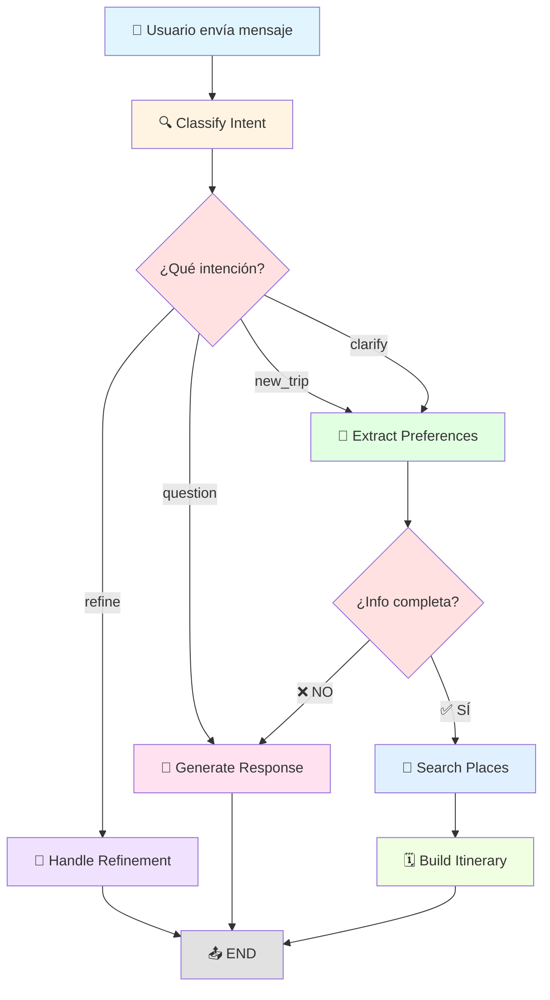

# 🤖 Arquitectura de Agentes - Vora Travel

## 📋 Tabla de Contenidos

- [Visión General](#visión-general)
- [Arquitectura del Sistema](#arquitectura-del-sistema)
- [Estado Compartido](#estado-compartido)
- [Flujo de Ejecución](#flujo-de-ejecución)
- [Nodos del Grafo](#nodos-del-grafo)
- [Tipos de Intención](#tipos-de-intención)
- [Ejemplos de Flujo](#ejemplos-de-flujo)
- [Características Avanzadas](#características-avanzadas)

---

## 🎯 Visión General

El sistema de agentes de Vora está construido con **LangGraph** y utiliza **GPT-4** para crear una experiencia conversacional inteligente que planifica viajes personalizados por Perú.

### Tecnologías Clave

- **LangGraph**: Framework de grafos para agentes conversacionales
- **GPT-4**: Modelo de lenguaje para procesamiento natural
- **Google Places API**: Búsqueda de lugares turísticos
- **Supabase**: Persistencia de itinerarios y conversaciones

---

## 🏗️ Arquitectura del Sistema

```
┌─────────────────────────────────────────────────────────────┐
│                    TRAVEL AGENT GRAPH                        │
│                      (LangGraph)                             │
├─────────────────────────────────────────────────────────────┤
│                                                              │
│  ┌──────────────────┐         ┌──────────────────┐         │
│  │ Intent Classifier│────────▶│Preference Extract│         │
│  └──────────────────┘         └──────────────────┘         │
│           │                            │                     │
│           │                            ▼                     │
│           │                    ┌──────────────┐             │
│           │                    │Check if Ready│             │
│           │                    └──────────────┘             │
│           │                       │         │                │
│           │                       │         │                │
│           │              ┌────────┘         └────────┐       │
│           │              ▼                           ▼       │
│           │      ┌──────────────┐         ┌──────────────┐  │
│           │      │Place Searcher│────────▶│Itinerary     │  │
│           │      └──────────────┘         │Builder       │  │
│           │                               └──────────────┘  │
│           │                                       │          │
│           ▼                                       ▼          │
│  ┌──────────────────┐                          ┌───┐        │
│  │Conversation Mgr  │◀─────────────────────────│END│        │
│  └──────────────────┘                          └───┘        │
│           │                                                  │
│           ▼                                                  │
│  ┌──────────────────┐                                       │
│  │Refinement Handler│                                       │
│  └──────────────────┘                                       │
│           │                                                  │
│           ▼                                                  │
│         ┌───┐                                               │
│         │END│                                               │
│         └───┘                                               │
└─────────────────────────────────────────────────────────────┘
```

### Estructura de Archivos

```
backend/app/agents/
├── state.py                    # Estado compartido (TravelState)
├── graph.py                    # Grafo principal de LangGraph
├── nodes/
│   ├── intent_classifier.py   # Clasifica intención del usuario
│   ├── preference_extractor.py # Extrae preferencias de viaje
│   ├── conversation_manager.py # Genera respuestas conversacionales
│   ├── place_searcher.py      # Busca lugares con Google Places
│   ├── itinerary_builder.py   # Construye itinerarios completos
│   └── refinement_handler.py  # Maneja refinamientos
└── tools/
    └── google_places.py        # Cliente de Google Places API
```

---

## 📊 Estado Compartido

El `TravelState` es el corazón del sistema. Mantiene toda la información durante la conversación:

```python
class TravelState(TypedDict):
    # 💬 Conversación
    messages: List[Message]              # Historial completo
    
    # 🎯 Intención actual
    intent: Literal["new_trip", "refine", "question", "clarify"]
    
    # 🧳 Preferencias del usuario
    destination: Optional[str]           # Ej: "Cusco"
    destinations: Optional[List[str]]    # Multi-ciudad
    start_date: Optional[date]
    end_date: Optional[date]
    days: Optional[int]                  # Ej: 5
    budget: Optional[str]                # "low", "medium", "high"
    travel_style: Optional[List[str]]    # ["cultural", "adventure"]
    travelers: Optional[int]             # Número de personas
    
    # 📍 Datos de lugares
    searched_places: List[PlaceInfo]     # Resultados de Google Places
    
    # 🗓️ Itinerario generado
    itinerary: Optional[Dict]
    day_plans: List[DayPlan]
    
    # 🧠 Contexto acumulado
    accumulated_summary: Optional[str]   # Resumen de lo conversado
    
    # ⚙️ Control de flujo
    needs_clarification: bool
    clarification_questions: List[str]
    iteration_count: int
    max_iterations: int                  # Límite: 10
```

---

## 🔄 Flujo de Ejecución

### Diagrama de Flujo Principal



### Flujo Detallado por Intención

#### 1️⃣ NEW TRIP / CLARIFY

```
Usuario: "Quiero viajar a Cusco"
    ↓
┌─────────────────────┐
│ Classify Intent     │ → Intent: new_trip
└─────────────────────┘
    ↓
┌─────────────────────┐
│ Extract Preferences │ → destination: "Cusco"
└─────────────────────┘
    ↓
┌─────────────────────┐
│ Check if Ready      │ → ❌ Falta: días
└─────────────────────┘
    ↓
┌─────────────────────┐
│ Generate Response   │ → "¿Cuántos días planeas estar?"
└─────────────────────┘
    ↓
  END

Usuario: "5 días"
    ↓
┌─────────────────────┐
│ Classify Intent     │ → Intent: clarify
└─────────────────────┘
    ↓
┌─────────────────────┐
│ Extract Preferences │ → days: 5
└─────────────────────┘
    ↓
┌─────────────────────┐
│ Check if Ready      │ → ✅ Tiene destino + días
└─────────────────────┘
    ↓
┌─────────────────────┐
│ Search Places       │ → Busca 30 lugares en Cusco
└─────────────────────┘
    ↓
┌─────────────────────┐
│ Build Itinerary     │ → Genera plan de 5 días
└─────────────────────┘
    ↓
  END (retorna itinerario completo)
```

#### 2️⃣ REFINE

```
Usuario: "Cambia el día 2, quiero más museos"
    ↓
┌─────────────────────┐
│ Classify Intent     │ → Intent: refine
└─────────────────────┘
    ↓
┌─────────────────────┐
│ Handle Refinement   │ → Analiza cambio solicitado
│                     │ → Busca más museos
│                     │ → Actualiza día 2
│                     │ → Mantiene coherencia
└─────────────────────┘
    ↓
  END (retorna itinerario modificado)
```

#### 3️⃣ QUESTION

```
Usuario: "¿Qué lugares hay en Arequipa?"
    ↓
┌─────────────────────┐
│ Classify Intent     │ → Intent: question
└─────────────────────┘
    ↓
┌─────────────────────┐
│ Generate Response   │ → Responde sobre Arequipa
└─────────────────────┘
    ↓
  END
```

---

## 🎯 Nodos del Grafo

### 1. 🔍 Intent Classifier

**Propósito**: Determinar qué quiere hacer el usuario

**Entrada**:
- Último mensaje del usuario
- Contexto de los últimos 6 mensajes
- Estado actual (destino, días, itinerario)
- Resumen acumulado

**Salida**:
- `intent`: "new_trip" | "clarify" | "refine" | "question"
- `iteration_count`: Contador incrementado

**Lógica**:
```python
# Reglas de clasificación
if primera_interacción or "nuevo viaje":
    return "new_trip"
elif ya_hay_viaje_en_curso and usuario_da_más_detalles:
    return "clarify"
elif hay_itinerario and usuario_pide_cambios:
    return "refine"
else:
    return "question"
```

**Características**:
- ✅ Analiza contexto completo
- ✅ Detecta respuestas a preguntas previas
- ✅ Previene loops infinitos (máx 10 iteraciones)
- ✅ Detecta frustración del usuario

---

### 2. 📝 Preference Extractor

**Propósito**: Extraer información del viaje del mensaje del usuario

**Entrada**:
- Mensaje del usuario
- Estado actual
- Resumen acumulado

**Salida**:
- `destination`: String
- `days`: Integer
- `budget`: "low" | "medium" | "high"
- `travel_style`: ["cultural", "adventure", "relaxed", "gastronomy", "nightlife"]
- `travelers`: Integer
- `accumulated_summary`: Resumen actualizado
- `needs_clarification`: Boolean
- `clarification_questions`: List[String]

**Lógica de Extracción**:
```python
# Extrae con GPT-4
prompt = """
Analiza el mensaje y extrae:
- Destino(s) en Perú
- Número de días
- Presupuesto (bajo/medio/alto)
- Estilo de viaje
- Número de viajeros

Contexto previo: {accumulated_summary}
"""

# Valida información mínima
if not destination or not days:
    needs_clarification = True
    clarification_questions = [...]
```

**Características**:
- ✅ Mantiene resumen acumulado
- ✅ No repite preguntas ya respondidas
- ✅ Detecta frustración
- ✅ Valida información progresivamente

---

### 3. 💬 Conversation Manager

**Propósito**: Generar respuestas conversacionales naturales

**Entrada**:
- Estado completo
- Preguntas de clarificación
- Contexto de últimos 15 mensajes

**Salida**:
- `messages`: Nuevo mensaje del asistente

**Modos de Operación**:

**Modo 1: Pedir Clarificación**
```python
if needs_clarification:
    # Genera pregunta sobre lo que FALTA
    # NO repite preguntas ya respondidas
    # Máximo 3-4 líneas
    # Una pregunta a la vez
```

**Modo 2: Confirmación Final**
```python
else:
    # Resume información (máx 3 líneas)
    # Pide confirmación para generar itinerario
    # Muestra entusiasmo
```

**Características**:
- ✅ Personalidad: Layla, experta amigable
- ✅ Usa emojis ocasionalmente
- ✅ Respuestas cortas y directas
- ✅ Detecta y maneja frustración
- ✅ Reconoce lo que el usuario acaba de decir

---

### 4. 🔎 Place Searcher

**Propósito**: Buscar lugares turísticos con Google Places API

**Entrada**:
- `destination`: String
- `budget`: String
- `travel_style`: List[String]
- `days`: Integer

**Salida**:
- `searched_places`: List[PlaceInfo] (top 30)

**Proceso**:
```python
1. Construir queries según estilo de viaje
   - cultural → "museos", "sitios históricos"
   - adventure → "trekking", "deportes extremos"
   - gastronomy → "restaurantes", "mercados"
   
2. Buscar en Google Places API
   - Filtrar por rating (>= 4.0)
   - Filtrar por presupuesto
   - Obtener fotos y detalles
   
3. Rankear resultados
   - Por rating
   - Por relevancia al estilo
   - Por diversidad de tipos
   
4. Retornar top 30 lugares
```

**Características**:
- ✅ Queries inteligentes por estilo
- ✅ Filtrado por presupuesto
- ✅ Diversidad de tipos de lugares
- ✅ Incluye fotos y ubicación

---

### 5. 🗓️ Itinerary Builder

**Propósito**: Construir itinerario completo día a día

**Entrada**:
- `searched_places`: List[PlaceInfo]
- `days`: Integer
- `destination`: String
- `budget`: String
- `travel_style`: List[String]

**Salida**:
- `itinerary`: Dict completo
- `day_plans`: List[DayPlan]

**Proceso**:
```python
1. Distribuir lugares por días
   - 3-5 lugares por día
   - Balance entre tipos
   
2. Organizar por horarios
   - Mañana (9am-1pm): 1-2 lugares
   - Tarde (2pm-6pm): 1-2 lugares
   - Noche (7pm-10pm): 1 lugar
   
3. Agrupar lugares cercanos
   - Minimizar desplazamientos
   - Rutas lógicas
   
4. Generar contenido
   - Título atractivo
   - Descripción del viaje
   - Consejos prácticos
   - Estimación de presupuesto
   
5. Formato final
   {
     "title": "5 Días Mágicos en Cusco",
     "description": "...",
     "day_plans": [...],
     "tips": [...],
     "estimated_budget": "$800-1200 USD"
   }
```

**Características**:
- ✅ Distribución inteligente
- ✅ Agrupación geográfica
- ✅ Balance de actividades
- ✅ Consejos personalizados
- ✅ Estimación de costos

---

### 6. 🔧 Refinement Handler

**Propósito**: Modificar itinerarios existentes

**Entrada**:
- `itinerary`: Dict actual
- Mensaje del usuario con cambios
- `destination`: String

**Salida**:
- `itinerary`: Dict modificado
- `day_plans`: List[DayPlan] actualizado

**Proceso**:
```python
1. Analizar qué cambiar
   - ¿Qué día?
   - ¿Qué tipo de cambio?
   - ¿Qué preferencias nuevas?
   
2. Buscar nuevos lugares si necesario
   - Según nuevas preferencias
   - Mantener presupuesto
   
3. Actualizar día(s) afectado(s)
   - Reemplazar lugares
   - Mantener coherencia horaria
   - Ajustar lugares cercanos
   
4. Explicar cambios
   - Qué se cambió
   - Por qué
   - Cómo afecta al resto
```

**Características**:
- ✅ Cambios quirúrgicos
- ✅ Mantiene coherencia
- ✅ Explica modificaciones
- ✅ Preserva estructura general

---

## 🎭 Tipos de Intención

### 1. NEW TRIP 🆕

**Cuándo**: Usuario quiere planear un viaje completamente nuevo

**Ejemplos**:
- "Quiero viajar a Cusco"
- "Ayúdame a planear un viaje a Arequipa"
- "Empecemos de nuevo, quiero otro destino"

**Flujo**:
```
new_trip → extract_preferences → check_if_ready → search_places → build_itinerary
```

---

### 2. CLARIFY 💬

**Cuándo**: Usuario responde a preguntas del asistente

**Ejemplos**:
- "5 días" (después de preguntar duración)
- "Somos 4 personas"
- "Presupuesto medio"
- "Sí, eso está bien"

**Flujo**:
```
clarify → extract_preferences → check_if_ready → [continúa según info]
```

**Características especiales**:
- ✅ Acumula información progresivamente
- ✅ No repite preguntas
- ✅ Detecta frustración

---

### 3. REFINE 🔧

**Cuándo**: Usuario quiere modificar un itinerario ya generado

**Ejemplos**:
- "Cambia el día 2, prefiero más museos"
- "Quita ese restaurante, no me gusta"
- "Agrega más actividades de aventura"

**Flujo**:
```
refine → handle_refinement → END
```

---

### 4. QUESTION ❓

**Cuándo**: Pregunta general sobre destinos o viajes

**Ejemplos**:
- "¿Qué lugares hay en Arequipa?"
- "¿Cuál es la mejor época para visitar Cusco?"
- "¿Necesito visa para Perú?"

**Flujo**:
```
question → generate_response → END
```

---

## 📝 Ejemplos de Flujo Completo

### Ejemplo 1: Viaje Nuevo Completo

```
👤 Usuario: "Quiero viajar a Cusco"

🤖 Sistema:
  ├─ Intent: new_trip
  ├─ Extract: destination="Cusco"
  ├─ Check: ❌ Falta días
  └─ Response: "¡Cusco es increíble! 🏔️ ¿Cuántos días planeas estar?"

👤 Usuario: "5 días"

🤖 Sistema:
  ├─ Intent: clarify
  ├─ Extract: days=5
  ├─ Check: ❌ Falta presupuesto
  └─ Response: "Perfecto. ¿Cuál es tu presupuesto aproximado?"

👤 Usuario: "Medio, somos 2 personas y nos gusta la cultura"

🤖 Sistema:
  ├─ Intent: clarify
  ├─ Extract: budget="medium", travelers=2, style=["cultural"]
  ├─ Check: ✅ Info completa
  ├─ Search: 30 lugares culturales en Cusco
  ├─ Build: Itinerario de 5 días
  └─ Response: [Itinerario completo con 5 días]
```

### Ejemplo 2: Refinamiento

```
👤 Usuario: "Cambia el día 2, quiero más museos y menos mercados"

🤖 Sistema:
  ├─ Intent: refine
  ├─ Analyze: Modificar día 2, más museos
  ├─ Search: Museos en Cusco
  ├─ Update: Reemplaza mercados por museos en día 2
  └─ Response: "He actualizado el día 2 con más museos:
               - Museo Inka
               - Museo de Arte Precolombino
               - Qorikancha
               Mantuve la cena en el restaurante que te gustó."
```

### Ejemplo 3: Manejo de Frustración

```
👤 Usuario: "Ya te dije que somos 4 personas, ¿por qué preguntas de nuevo?"

🤖 Sistema:
  ├─ Intent: clarify
  ├─ Detect: user_frustrated=True
  ├─ Extract: travelers=4 (confirmado)
  └─ Response: "Disculpa, tienes razón. Tengo:
               - Cusco, 5 días, 4 personas, presupuesto medio
               ¿Listo para generar tu itinerario? ✨"
```

---

## 🚀 Características Avanzadas

### 1. Memoria Conversacional

```python
# Mantiene contexto de últimos 6-15 mensajes
recent_context = "\n".join([
    f"{msg['role']}: {msg['content']}"
    for msg in messages[-6:]
])

# Resumen acumulado para evitar repeticiones
accumulated_summary = """
- Destino: Cusco
- Días: 5
- Presupuesto: medio
- Estilo: cultural, gastronomy
- Viajeros: 4
"""
```

### 2. Validación Progresiva

```python
# Solo pide lo que falta
required_fields = {
    "destination": bool(state.get("destination")),
    "days": bool(state.get("days"))
}

missing = [k for k, v in required_fields.items() if not v]

if missing:
    needs_clarification = True
    # Pregunta solo por lo que falta
```

### 3. Detección de Frustración

```python
frustration_phrases = [
    "ya te dije", "ya lo dije", "repet", 
    "otra vez", "constantemente"
]

user_frustrated = any(
    phrase in last_user_msg.lower() 
    for phrase in frustration_phrases
)

if user_frustrated:
    # Disculparse y confirmar info
    # No repetir preguntas
```

### 4. Prevención de Loops

```python
# Límite de iteraciones
if state.get("iteration_count", 0) > 10:
    logger.warning("Máximo de iteraciones alcanzado")
    return "new_trip"  # Reinicia
```

### 5. Rate Limiting

```python
# En el endpoint /api/v1/chat
@limiter.limit("10/minute")
async def chat_endpoint():
    # Máximo 10 requests por minuto por IP
    pass
```

### 6. Persistencia

```python
# Guarda en Supabase
itinerary_data = {
    "user_id": user.id,
    "thread_id": thread_id,
    "destination": destination,
    "itinerary": itinerary,
    "status": "draft"  # draft, confirmed, completed
}

supabase.table("itineraries").insert(itinerary_data)
```

---

## 🔧 Configuración

### Variables de Entorno

```env
# OpenAI
OPENAI_API_KEY=sk-...
OPENAI_MODEL=gpt-4o

# Google Places
GOOGLE_PLACES_API_KEY=AIza...
GOOGLE_MAPS_API_KEY=AIza...

# Supabase
SUPABASE_URL=https://...
SUPABASE_KEY=eyJ...

# Rate Limiting
RATE_LIMIT_PER_MINUTE=10
```

### Endpoint Principal

```bash
POST /api/v1/chat
Content-Type: application/json
Authorization: Bearer <token>

{
  "message": "Quiero viajar a Cusco por 5 días",
  "thread_id": "optional-thread-id",
  "save_conversation": true
}
```

### Respuesta

```json
{
  "message": "¡He creado tu itinerario perfecto!...",
  "thread_id": "uuid-thread-id",
  "itinerary": {
    "title": "5 Días Mágicos en Cusco",
    "description": "...",
    "day_plans": [...],
    "tips": [...],
    "estimated_budget": "$800-1200 USD"
  },
  "needs_clarification": false,
  "clarification_questions": []
}
```

---

## 🧪 Testing

### Ejecutar Tests

```bash
cd backend
pytest tests/test_agents.py -v
```

### Prueba Manual

```bash
cd backend
python test_agent.py
```

### Test de Flujo Conversacional

```bash
python test_conversational_flow.py
```

---

## 📈 Mejoras Futuras

- [ ] Soporte para multi-ciudad en un solo viaje
- [ ] Integración con APIs de transporte (vuelos, buses)
- [ ] Cálculo de rutas óptimas entre lugares
- [ ] Recomendaciones de hoteles por zona
- [ ] Integración con calendarios (Google Calendar)
- [ ] Exportar itinerarios a PDF
- [ ] Compartir itinerarios públicamente
- [ ] Sistema de favoritos y guardados
- [ ] Notificaciones de cambios de precio
- [ ] Integración con booking de actividades

---

## 📚 Referencias

- [LangGraph Documentation](https://python.langchain.com/docs/langgraph)
- [Google Places API](https://developers.google.com/maps/documentation/places/web-service)
- [OpenAI GPT-4](https://platform.openai.com/docs/models/gpt-4)
- [Supabase Documentation](https://supabase.com/docs)

---

**Última actualización**: 17 de febrero de 2026
**Versión**: 1.0.0
